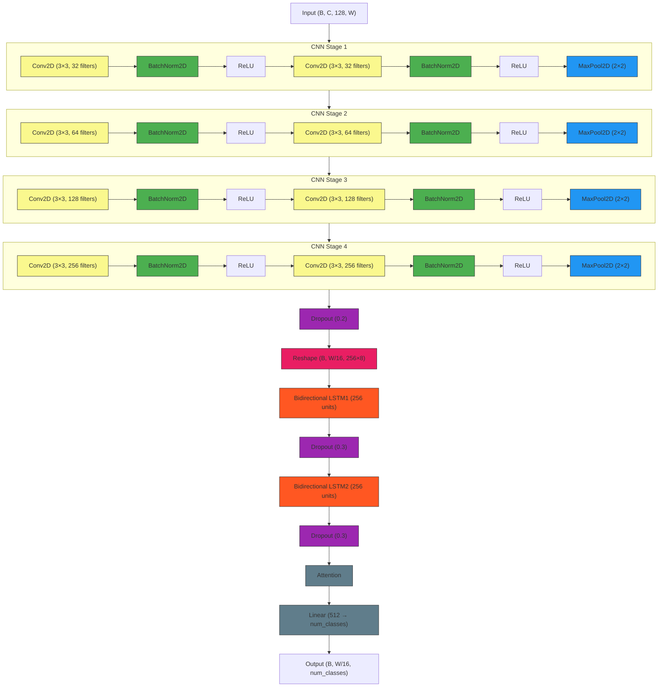

# HumanAI RenAissance Selection Task Solution

This repository contains the solution to the selection task for HumanAI-RenAissance project for GSOC 2025.

## Project
Synthetic renaissance text generation with generative models

## Task (Optical Character Recognition)
Build a model based on convolutional-recurrent, transformer, or self-supervised architectures for optically recognizing the text of each data source. 
Your model should be able to detect the main text in each page, while disregarding other embellishments. Pick the most appropriate approach and discuss your strategy.

## Workflow

To solve the task I have developed an CRNN model using pytorch which perform OCR at word level.

### 1. Dataset generation for model training
 - I have also added *Luisa de Padilla’s Nobleza Virtuosa* to the 6 PDFs that were provided.

   I have renamed all the PDF files and respecive transcript for convenience.

```bash
Padilla - 1 Nobleza virtuosa : book1
Padilla - 2 Nobleza virtuosa : book2
PORCONES.228.35 – 1636.pdf : book3
Constituciones sinodales Calahorra 1602.pdf : book4
Ezcaray - Vozes.pdf : book5
Mendo - Principe perfecto.pdf : book6
Paredes - Reglas generales.pdf : book7
Buendia - Instruccion.pdf : book8
```
   

 - Some pages of the pdf contain 2 pages in a single page so we need to split them.
 - 
   

 - after creating images of individual pages from the PDFs, I have applied various transformation to the Images. Preprocessing images allows for better text detection and recognition.

   `IMAGE ---> GRAYSCALE ---> SKEW CORRECTION ---> NORMALIZING ---> SCALING ---> INK BLEED REMOVAL ---> BINARIZING ---> DENOISING ---> SAHRPENING ---> CONTRAST ENHANCEMENT ---> ERODING ---> Layout Detection ---> PADDING `

    

- For the purpose of layout detection I experimented with 2 different pretrained models, the **YOLOv11** and the **Paddle DocLayout** model. Although both the model gave errors in predicting the layout i decided to procede with
  the Paddle DocLayout model. ( the performance can be improved by fine tuning these models but will require annotated data)

<<<<<<< HEAD
  
=======
    
>>>>>>> 3d528bb66b9a4757385a580e2094f5b9a2993cba

  - For text detection I used two different models. The DBNET+ model and the CRAFT model. CRAFT was able to produce word level bounding boxes.
    
   

- Now that I have the bounding box coordinates for individual words on the page. I need to map them to their corresponding word in the transcript provided.
    - I decided to use a **pretrained OCR model (Tesseract)**, specifically one trained for **Spanish text recognition**.
    - For each bounding box on a page, the model predicts the recognized text. Then, we compute a **similarity score** between the prediction and all words in the transcript.
       The word with the highest similarity score is assigned to the bounding box, provided that the score exceeds a predefined threshold.
    - I set a **similarity threshold of 0.7**, ensuring that only confident matches are used for labeling the word images.
 
      

- Once the mapping is them I saved the bounding box regions as word images and created a dataframe containing the image_name and their corresponding label.

- I have applied various augmentation techniques to increase the size of our dataset. I have generated 4 augmented images for each word image.

    

  Now that we have our data in the desired form we can use it for training our CRNN model.

## Model Building
I have used pytorch for training a CRNN model.

- I created a vocabulary from the labels ( all the unique character available in our label or transcripts).
  
```bash
<<<<<<< HEAD
Total number of unique characters before : 61
Unique Characters : 
{'s', 'l', 'e', 'v', 'x', 'G', 'X', 'I', 'h', 'H', 'r', 'í', 't', 'n', 'q',
 '9', '2', 'M', 'B', 'Y', 'é', 'N', 'Ñ', '5', 'ñ', 'á', 'O', 'J', 'g', 'b',
  'a', 'U', 'D', 'p', 'K', 'V', 'd', 'S', 'R', 'ó', '6', 'i', '7', 'm', 'E',
   'P', 'z', 'L', '1', 'j', 'f', 'F', 'Z', 'C', 'T', 'u', 'Q', 'o', 'c', 'A',
    'y'}
=======
Total number of unique characters before : 62
Unique Characters : 
{'h', 't', 'p', 'V', 'Y', 'g', 'a', 'C', 'x', 'd', 'b', 'z', 'j', 'l', 'K', 'm', 'n', '6', 'H', 'u', 'T', 'y',
 'r', 'L', 'M', '9', 'ó', 'O', 'o', 'F', 'R', 'v', 'Q', 'á', '2', '1', 's','8', 'f', 'c', 'P', 'Z', 'S', 'A',
 'q', 'i', 'B', 'I', 'E', 'N', 'G', 'X', 'ë', 'í', 'D', 'e', 'é', 'U', 'Ñ', 'ñ', '5', 'J'}
>>>>>>> 3d528bb66b9a4757385a580e2094f5b9a2993cba
```

- Based on the noted provided in the transcript files, I have modified our vocabulary using a rule based approach.

```bash
Total number of unique characters after normalization: 31
Normalized unique characters: 
<<<<<<< HEAD
{'s', 'l', 'e', 'x', 'h', 'r', 't', 'n', 'q', '9', '2', '5',
 'ñ', 'g', 'b', 'a', 'p', 'd', '7', '6', 'i', 'm', 'z', '1', 'j',
  'f', 'u', 'o', 'k', 'c', 'y'}
=======
{'h', 't', 'p', 'g', 'a', 'x', 'd', 'b', 'z', 'j', 'l', 'm', 'n', '6', 'u', 'y', 'r', '9', 'o', '1', '2',
's', '8', 'f', 'c', 'k', 'q', 'i', 'e', 'ñ', '5'}
>>>>>>> 3d528bb66b9a4757385a580e2094f5b9a2993cba
  ```

- Created a character-to-idx and idx-to-character mapping for our generated vocabulary.

```bash
<<<<<<< HEAD
Character to index mapping: {'1': 1, '2': 2, '5': 3, '6': 4, '7': 5, '9': 6, 'a':7,
 'b': 8, 'c': 9, 'd': 10, 'e': 11, 'f': 12, 'g': 13, 'h': 14, 'i': 15, 'j': 16,
  'k': 17, 'l': 18, 'm': 19, 'n': 20, 'o': 21, 'p': 22, 'q': 23, 'r': 24, 's': 25,
  't': 26, 'u': 27, 'x': 28, 'y': 29, 'z': 30, 'ñ': 31, '<blank>': 0}
=======
Character to index mapping: {'1': 1, '2': 2, '5': 3, '6': 4, '8': 5, '9': 6, 'a': 7, 'b': 8, 'c': 9, 'd': 10, 'e': 11, 'f': 12, 'g': 13,
 'h': 14, 'i': 15, 'j': 16, 'k': 17, 'l': 18, 'm': 19, 'n': 20, 'o': 21, 'p': 22, 'q': 23, 'r': 24, 's': 25, 't': 26, 'u': 27, 'x': 28,
'y': 29, 'z': 30, 'ñ': 31, '<blank>': 0}
>>>>>>> 3d528bb66b9a4757385a580e2094f5b9a2993cba
Number of classes (including blank): 32
```

- created DataSet class and a custom collate function to get the data.
  
Our data contain images of variable size but a NN model requires an input of fixes dimension so We need to add padding to our word Images.
1. We can just resize our images but this will result in loss of information or distortion of the text font.
2. we can map all the images to the maximun image size in our dataset. But:
    * there are chances that average size of images are less compared to max size resulting in very large amount of padding. This result in unnecessary weights in our model increasing the compute.
    * During inference there are chance that input is greater than the largest image in training dataset.

SO I have updated the the Dataset Class to transform all the images to a fixed height of 129 pixels and a variable width based on the actual aspect ratio.

Instead of padding all images to a fixed size before training, the collate function ensures that each batch is padded to match the largest image in that batch.

A collate function transforms individual samples into batches suitable for model training.

Why is this beneficial?
- **Reduces unnecessary padding:** Instead of padding all images to the largest in the dataset, we only pad to the largest in each batch, reducing computational overhead.
- **Preserves aspect ratios:** Since images are resized based on height while maintaining width proportionally, text distortion is minimized.
- **Flexible for inference:** During testing, we can adapt to varying image sizes without constraints from the training set's maximum size.

  
    


- I have used the following model architecture, with early stopping callback(patience:5) to prevent overfitting and learning rate scheduling for stablized learning:

### Defining Model Architecture
  
<<<<<<< HEAD
=======
### Defining Model Architecture
  
>>>>>>> 3d528bb66b9a4757385a580e2094f5b9a2993cba

<<<<<<< HEAD
lets assume that our input image has a dimension (3,w,h). The image will be processed through our model accoringly:

```bash
(batch, 3, w, h) → Input RGB image
↓ [Conv1 block + MaxPool]
(batch, 32, w/2, h/2)
↓ [Conv2 block + MaxPool]
(batch, 64, w/4, h/4)
↓ [Conv3 block + MaxPool]
(batch, 128, w/8, h/8)
↓ [Conv4 block + MaxPool]
(batch, 256, w/16, h/16)
↓ [Reshape for LSTM]
(batch, w/16, 256*(h/16)) → Each timestep contains features from a column of the feature map
↓ [LSTM 1 (bidirectional)]
(batch, w/16, 512)   512 = 256*2 (bidirectional)
↓ [LSTM 2 (bidirectional)]
(batch, w/16, 512)
↓ [Attention Layer]
(batch, w/16, 512) 
↓ [Fully Connected Layer]
(batch, w/16, Vocabulary Size) → Per-timestep character predictions for CTC loss
```

### Loss Function Used [CTC(Connectionist Temporal Classification)] 


After the text detection step, regions, where the text is present, are cropped and sent through convolutional layers to get the features from the image. Later these features are fed to many-to-many LSTM architecture, which outputs softmax probabilities over the vocabulary.  These outputs from different time steps are fed to the CTC decoder to finally get the raw text from images.

the model predicts a character probability distribution for each of the w/16 timesteps. However, the ground truth is just the text (e.g., "HELLO") without specifying which timestep corresponds to which character.

**CTC Loss allows us to align our predictions to the actual ground truth. CTC computes the probability of all possible alignments between the predicted sequence and the ground truth, then maximizes the sum of these probabilities.**


**Key Components of CTC**

1. Blank Token: CTC introduces a special "blank" token  to handle:

Repeated characters (e.g., "HELLO" vs "HEELLLLOO")
Different sequence lengths (typically, predictions are longer than labels)

(I added the blank token while creating the char_to_idx mapping)

2. Many-to-One Mapping: CTC defines a many-to-one mapping that collapses predictions into ground truth:

First, it merges repeated characters (unless separated by blank)
Then, it removes all blank tokens

For example:

Prediction: "H-EE-L-L-O" → "HELLO"
Prediction: "HHH--EEELLL--OO" → "HELLO"

3. Probability Computation: For each possible alignment path, CTC calculates its probability based on your model's outputs.


our model outputs (batch, w/16, Vocabulary Size) so we have w/16 predictions for each image. so for each image CTC computes the probability of all valid alignments across the w/16 timesteps. **The loss is the negative log of the sum of these probabilities**
=======

### Loss Function Used(CTC LOSS)


>>>>>>> 3d528bb66b9a4757385a580e2094f5b9a2993cba

### Results

I also trained the model without applying the preprocessing step to check how much improvement in performance can be achieved.

| Metric      | Without Preprocessing | With Preprocessing |
|------------|----------------------|-------------------|
<<<<<<< HEAD
| Train Loss | 0.0211              | 0.0155           |
| Val Loss   | 0.0618              | 0.0486           |
| Accuracy   | 0.9521              | 0.9596           |
| CER        | 0.0160              | 0.0131           |

During training(with preprocessing) the accuracy reached till 0.965 and can be further improved by fine tuning the early stopping patience.
=======
| Train Loss | 0.0621               | 0.0478           |
| Val Loss   | 0.1983               | 0.1526           |
| Accuracy   | 0.8642               | 0.8950           |
| CER        | 0.0527               | 0.0384           |
>>>>>>> 3d528bb66b9a4757385a580e2094f5b9a2993cba


<<<<<<< HEAD
the details of the training can be found in `/models` folder [here](https://iitbhu365-my.sharepoint.com/:f:/g/personal/saarthak_gupta_mec22_iitbhu365_onmicrosoft_com/EmmfM8DCrjlIr9iSP_KBMu0BbnYZ2szhd7zWK2mjeF8skQ?e=cuNL2A).
=======
the details of the training can be found in `/models` folder.
>>>>>>> 3d528bb66b9a4757385a580e2094f5b9a2993cba

### Testing
Now finally I used the trained model to generate transcripts for the testing pages.(These are the page of the book for which no transcripts were provided).

Example of full text generated transcript:
```
M pras H   l adre aestro  Fr Diego Miseno  res
el a eerendisimo
eliie E Dorden y Comision de V Ahe visto con
ees roincial ors Defiidor mayor de la Prounci
igual Orden de APROBACION gusto vn libro cuyo titulo de
de del  Sslio Mag octor
eos  i Principe Ministros ajustados Docss
la
entos Politicos s  Morales cuyo Author es el muy
RPadre Andres Meno Compañiad Iesus Re
ctor del de Irlandeses de Salamanca de
r
Calificador del Consejo de la
piii
Suprema y no auer encontra
opeoo
do proposicion que al sincero sentir
aoa cao
de nuestra honesto proceeder
cbgrn
de las Christianas j Iuzgo no solo por de
leytables por sumamente vtiles estos Documentos
consagrados a lerudicion y enseñanza sin
ciog
gular los Principes Monarchas Alabo la eleccion
pues como diijo ribs ce sientiis aliuid
lo
babes y mn magir i Rego

ciuli  Ccn illie  lluem ciuem
meliorem docioreme faias hie i vno onmes El sla
caar a vn Principe consumado estudiante en el arte
de governar es lo mismo que hazer docto y sabio to
do el Principado s pues de aquel Mobil depe

den las acciones  y de aquella las infuencias
todo lo restante del cuerpo y en los libros eos sin
duda s que beben mas ncera a y pura la enseñana
en otros medios Y oue como dijo el doctissimo
a
hablando con los  unt apd os
ra
ateorai cosisi copiam asidut vtinam con
slij
```
The final transcripts for all the pages is available in `/predictions` folder.
  
## Setup Instructions
To reproduce the results follow the below instructions

### Install Dependencies
Run the following command to install required libraries:

```bash
pip install -r requirements.txt
```

### Configure Tesseract OCR
Ensure **Tesseract OCR** is installed and correctly configured:
- **Windows:** Set the path to `tesseract.exe` in the notebook.

### Running the Notebook
1. Clone this repository:
   ```bash
   git clone https://github.com/sarthakg004/HumanAI-RenAIssance.git
   cd HumanAI-RenAIssance
   ```
2. Open the Jupyter Notebook:
   ```bash
   jupyter notebook experimentation.ipynb
   ```
3. Run Each cell sequentially.

